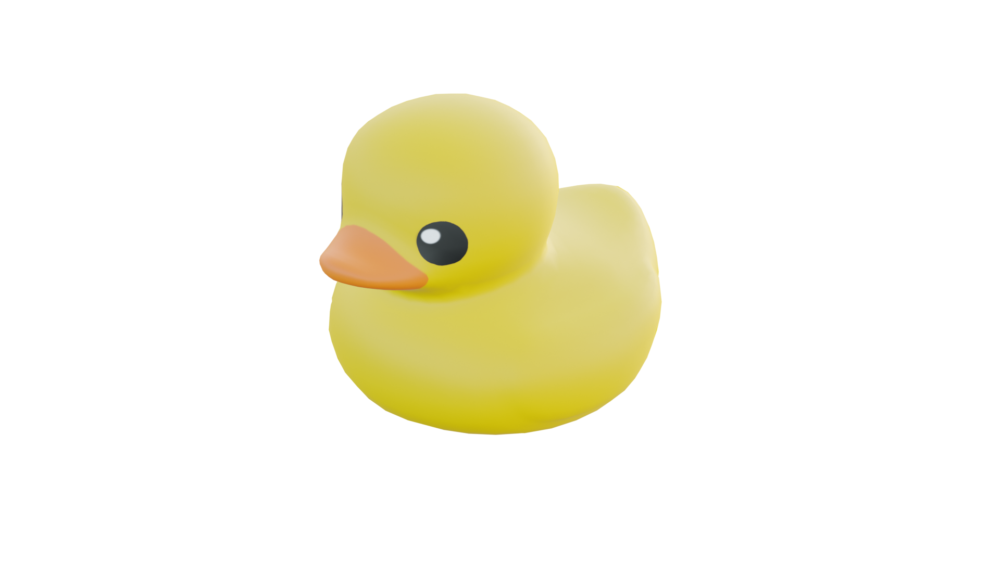

# 🦆 Desktop Duck

Welcome to **Desktop Duck**, the open-source 3D companion that helps you focus (or just stares at you while you procrastinate). 

He's simple, he's funny, and he's here to stay on top of all your windows, watching your every move. Literally.

## ✨ Features

*   **Always On Top:** Like a true friend, he never leaves your side.
*   **Mouse Tracking:** He watches your cursor. He knows what you're doing.
*   **Caret Tracking:** When you're typing, he leans in to see your genius (or your typos).
*   **Interactive:** Drag him around! He quacks when you grab him.
*   **Customizable:** Don't like ducks? (Who are you?) You can swap the 3D model for anything you want!
*   **Hide for Focus:** If he's too distracting, you can ask him to hide for a bit.

## 🚀 Getting Started

### Installation

Download the latest version from the [Releases](https://github.com/Abdelaal251-onspec/desktop-duck/releases) page. It's portable, so just run it and you're good to go!

### Development

If you want to play with the code:

1.  Clone this repo: `git clone https://github.com/Abdelaal251-onspec/desktop-duck.git`
2.  Install dependencies: `npm install`
3.  Start the duck: `npm start`

## 🛠 Customization

You can change the 3D model to anything your heart desires (as long as it's a `.glb` or `.gltf` file).

1.  Right-click on the duck.
2.  Select **"Change Model..."**.
3.  Pick your favorite 3D file.
4.  Enjoy your new desktop companion!

*Want to go back? Just right-click and select **"Reset to Default Duck"**.*

## 🤝 Contributing

This is a simple project made for fun. If you have ideas for more silly features, feel free to open an issue or a PR! 

Some ideas:
*   Different quack sounds.
*   Duck hats.
*   A "productivity mode" where he judge you if you open social media.

## 📜 License

This project is licensed under the ISC License. 

---

*Made with 💛 and a lot of quacks.*
